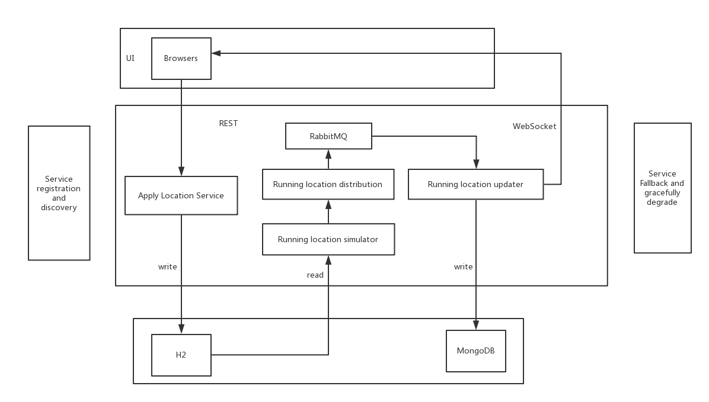

# Real-time-Running-Location-Simulation-Application
Running Location Simulating system is a back end web real-time microservice system, using Java, Spring Boot, Spring Data, Spring Cloud, RabbitMQ, MongoDB, and H2

#### System disign:


#### Services:
* RabbitMQ: process payment asynchronously for preventing a hard handling with too many orders  

* Eureka: services registration and discovery

* Hystrix: services fall and gracefully degrade

* Running location service : Frontend can use running location service to initialize all locations during startup

* Running location simulator: Simulating running locations defined in JSON file and scheduled to run. Sending current location, including runningId, location lat, location logitude, runner status, speed, and heading to location distribution service

* Running location distribution service: Publish current locations to locations queue in RabbitMQ

* Running location updater: Consume current locations from locations queue in RabbitMQ, and setup Websocket connect and push locations to client

## Getting Started

These instructions will get you a copy of the project up and running on your local machine for development and testing purposes.

### Prerequisites


```
Java JDK 1.8
Maven
Docker
```

### Installing

Change your current Location to running-simulating-system</br>
```
$ cd ../running-simulating-system
```
Create executable jar files
```
$ mvn clean install
```
Go into each module target folder and run jar file by run following Services' introduction order.

```
$ java -jar [jar file]
```

## Running the tests

#### Automation Test
Integration test and MockMvc test run automatically while building jar files.

#### Manual Tests
Use Google App Postman and  to test
* Supply-location-service test :
  1. Set Postman's Http method as Post

  2. Input url:
      http://localhost:9001/bulk/supplyLocations

  3. Upload running location JSON file

* Running-location-simulator test:
  1. Set Postman's Http method as PUT

  2. Input url:
    http://localhost:9006/api/{simulation/cancel}

  3. To start or end simulation

Open eureka, rabbitMQ, and hystrix corresponding urls to confirm every microservice run correctly
